# ☁️ CloudStore — E-Commerce Platform on AWS

A full-stack e-commerce platform built to demonstrate real-world AWS cloud infrastructure. Features a live marketplace with Seller/Buyer roles, AI-generated art products, and a built-in Cloud Infrastructure Status dashboard.

---

## 🚀 Live Infrastructure

| Service | Status | Latency |
|--------|--------|---------|
| 🗄️ Amazon RDS (MySQL) | ✅ Available | ~7 ms |
| ⚡ ElastiCache (Redis) | ✅ Online | ~8 ms |
| 📨 Amazon MQ (RabbitMQ) | ✅ Running | ~44 ms |
| 🪣 Amazon S3 | ✅ Active | — |
| 🌐 Elastic Beanstalk | ✅ Deployed | — |

---

## 🏗️ Architecture

```
User Request
     │
     ▼
Elastic Beanstalk (EC2)
     │
     ├──► Amazon RDS (MySQL)       → Persistent data storage
     ├──► ElastiCache (Redis)      → Caching & session management
     ├──► Amazon MQ (RabbitMQ)     → Async order processing
     └──► Amazon S3                → Product image storage
                                        │
                                        ▼
                                  CloudWatch Dashboard
                                  (Monitoring & Metrics)
```

---

## ⚙️ Tech Stack

### Backend


### AWS Services


---

## ✨ Features

### 🛍️ Marketplace
- **Buyer** — Browse products, purchase, track orders
- **Seller** — Add/manage products, view incoming orders
- Product images stored and served directly from **AWS S3**
- Category filtering & stock management

### ☁️ Cloud Infrastructure Dashboard
Built into the app — shows live connection status and performance benchmarks:
- Real-time latency for RDS, ElastiCache, Amazon MQ
- **Performance Benchmark**: MySQL direct query vs Redis cache
- Redis proved **1.6x–2.6x faster** than direct RDS queries

### 📊 Monitoring
- **CloudWatch Dashboard** tracking:
  - Request count per target
  - Database connections
  - Cache hits/misses

---

## 📸 Screenshots

### ☁️ Cloud Infrastructure Status — Live Connections
> Amazon RDS · ElastiCache · Amazon MQ all Online with real-time latency

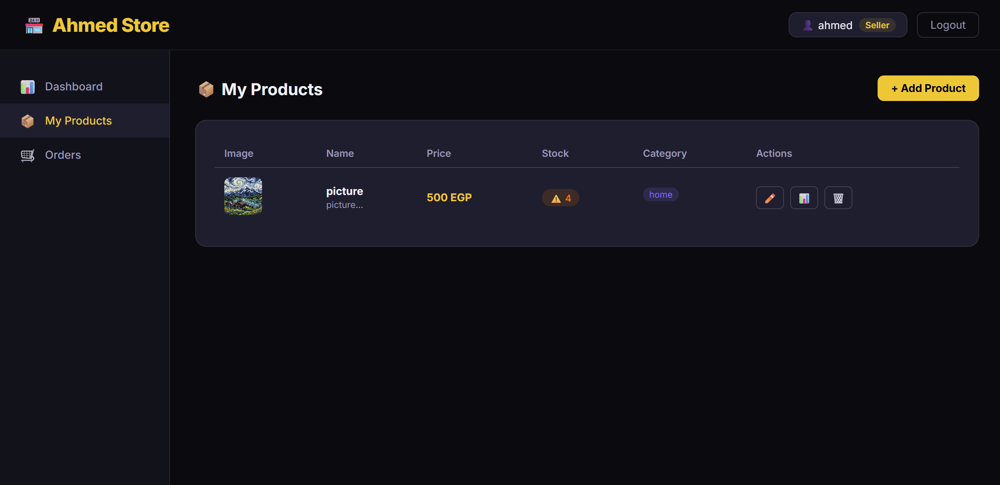

### ☁️ Cloud Infrastructure Status — Performance Benchmark
> Redis is 2.6x Faster than RDS


### 🛍️ Available Products
> Products with images served from S3

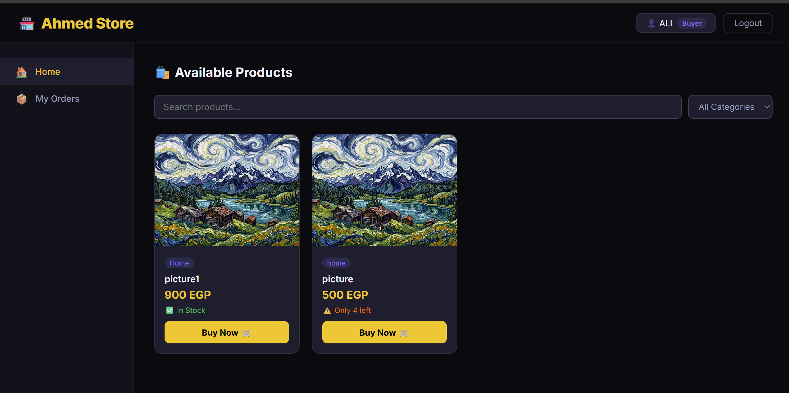

### 📦 Seller — My Products
> Seller dashboard with product management

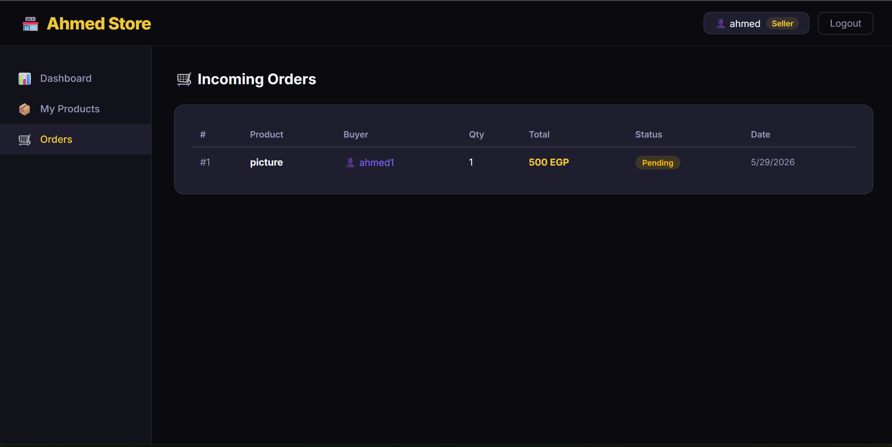

### 🧾 Buyer — My Orders
> Buyer order history with status tracking

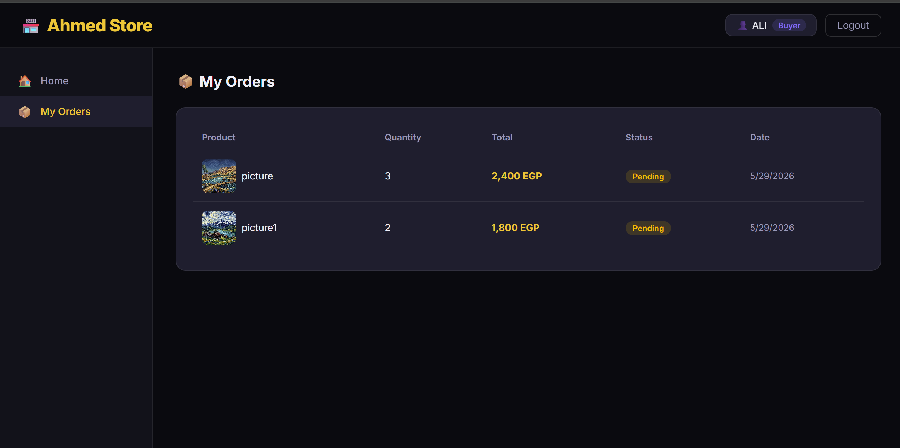

---

### 🗄️ AWS RDS — Instance Summary
> Status: Available · Engine: MySQL Community · Class: db.t3.micro · Region: us-east-1c


### 🗄️ AWS RDS — Instance List
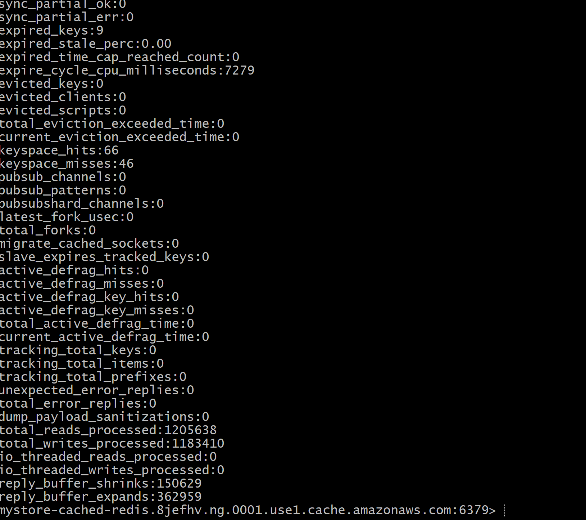

### 🐬 MySQL — Live Query via EC2
> SHOW TABLES + SELECT products from RDS

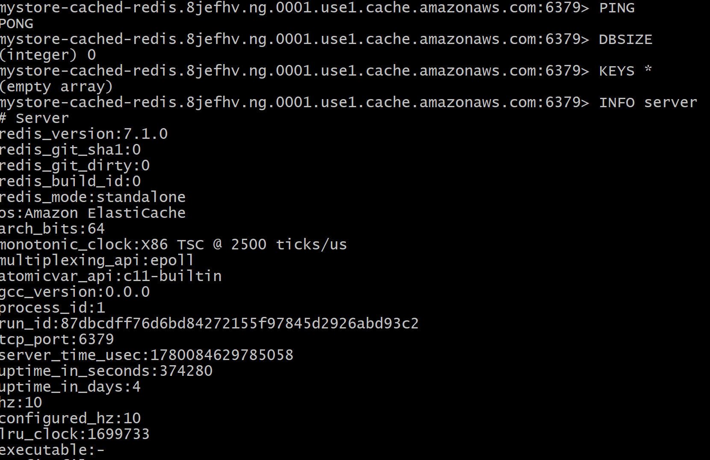

### ⚡ ElastiCache Redis — PING / PONG
> Connected to ElastiCache from EC2 · uptime: 4 days

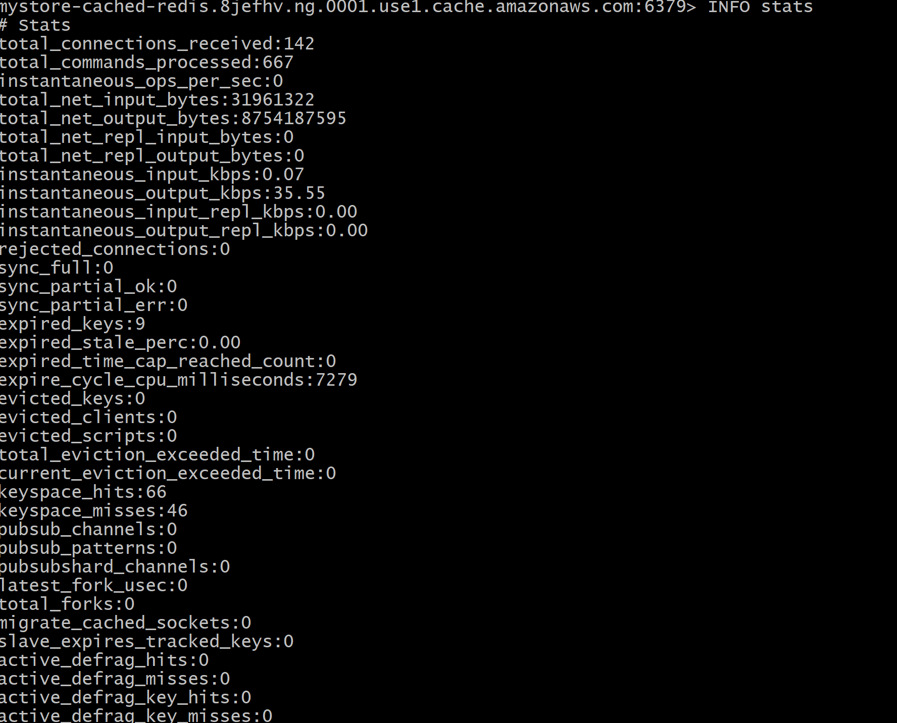

### ⚡ ElastiCache Redis — INFO stats
> total_connections: 142 · commands_processed: 667 · keyspace_hits: 66

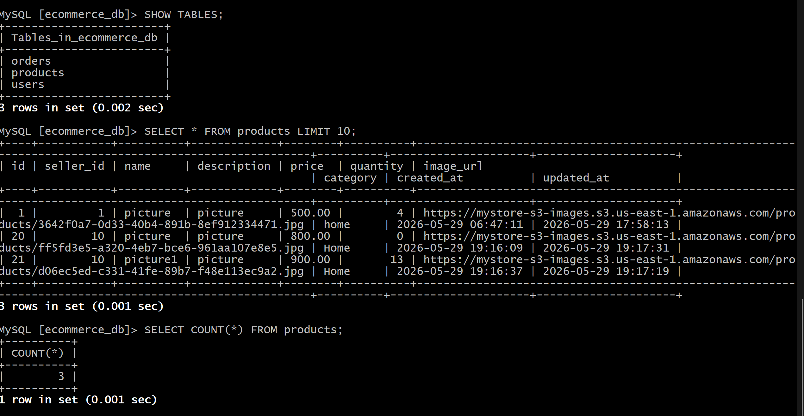

---

### 🪣 Amazon S3 — Bucket with Full Sidebar
> mystore-s3-images · 21 product images · Standard storage class

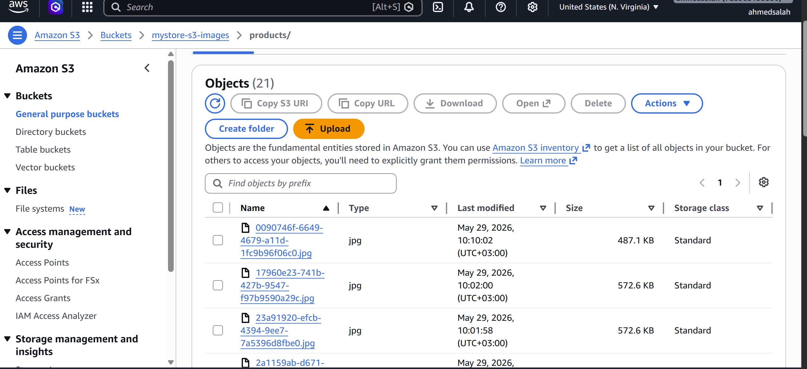

### 🪣 Amazon S3 — Bucket View


### 🪣 Amazon S3 — Bucket Cropped


### 🌐 Amazon S3 — Image Served via Public URL
> AI-generated art image accessible directly from S3 URL


---

### 📨 Amazon MQ — Broker Details
> mystore-MQ · Status: Running · Engine: RabbitMQ 3.13 · Instance: mq.m7g.medium · CloudWatch Logs: Enabled

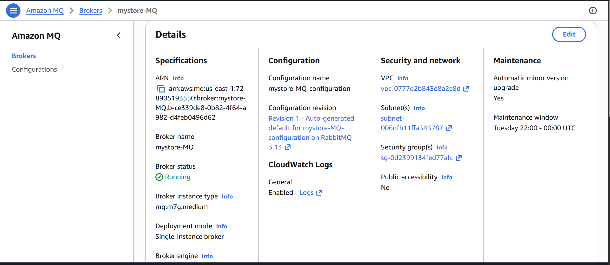

### 📊 CloudWatch Dashboard
> RequestCountPerTarget · DatabaseConnections · CacheHits/Misses

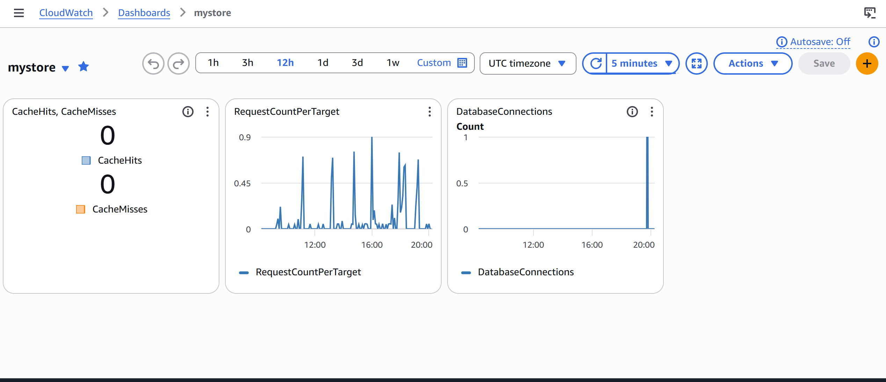

---

## 🗄️ Database Schema

```sql
-- ecommerce_db
├── users      (id, username, email, role, created_at, ...)
├── products   (id, seller_id, name, description, price, quantity, image_url, category, created_at, updated_at)
└── orders     (id, buyer_id, product_id, quantity, total, status, created_at, ...)
```

---

## 📈 Performance Results

```
MySQL (RDS) direct query:   ~13 ms  ████████████████████
Redis (ElastiCache) cache:   ~5 ms  ████████

🚀 Redis is 2.6x Faster than RDS
```

---

## 🧱 AWS Services Summary

| Service | Config | Purpose |
|---------|--------|---------|
| **Elastic Beanstalk** | EC2 | App hosting & deployment |
| **RDS MySQL** | db.t3.micro · us-east-1c | Relational database |
| **ElastiCache Redis** | v7.1.0 · standalone | Caching & sessions |
| **Amazon MQ** | mq.m7g.medium · RabbitMQ 3.13 | Async message queue |
| **S3** | Standard · 21 objects | Product image storage |
| **CloudWatch** | Custom dashboard | Monitoring & metrics |
| **VPC / Security Groups** | Private subnets | Network isolation |

---

## 🔧 Environment Variables

```env
AWS_REGION=us-east-1
DB_HOST=<your-rds-endpoint>
DB_NAME=ecommerce_db
DB_USER=admin
DB_PASS=<your-password>
REDIS_HOST=<your-elasticache-endpoint>
MQ_URL=amqps://<user>:<pass>@<your-mq-endpoint>:5671
S3_BUCKET=<your-bucket-name>
PYTHONPATH=/var/app/venv/staging-LQM1lest/bin
```

---

## 👤 Author

**Ahmed Salah**
